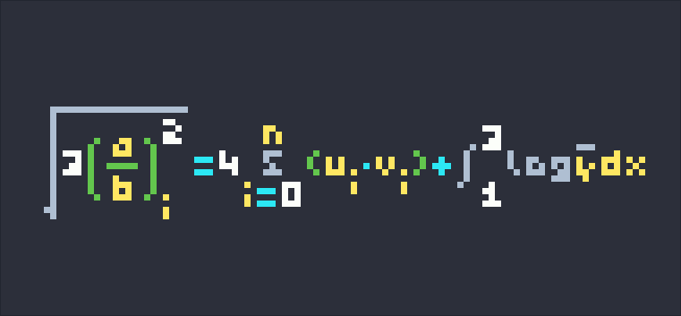
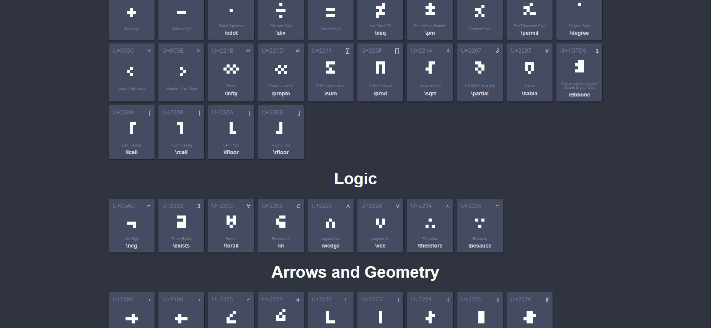

# pixeltex 👌

<style>
    img { border-radius:3px; filter:drop-shadow(0 0 4px #222); }
    #teaser { display:grid; grid-template-columns:1fr 1fr; gap:20px; margin:10px; }
</style>
<link rel="stylesheet" type="text/css" href="styles/footer.css">
<div id="teaser">
    </img>
    </img>
</div>

[`PIXELTEX`](https://gurki.github.io/pixeltex) - a fun little latex and emoji pixel typesetter<br>
[`MINIGENT`](https://gurki.github.io/minigent) - an extensive <u title="mostly; extended set also includes 2x4, 2x5, 3x5, 4x4, 5x4 for math and other symbols">3x4</u> pixel font for miniature typesetting<br>

# MINIGENT 🎩
While working on some **pixel art**, I started designing some tiny letters to go with it. Suprisingly, I had a ton of fun and soon it **escalated** a little bit. I tried out greek letters, emojis and even full-on typeset formulas. Seeing the results and the potential, I decided to set out and extend the font with the most **relevant symbols** for everyday use and basic `LaTeX` typesetting.

The `MINIGENT` font is designed for **readibility** (unbroken reading flow at small and large scales) and **extensability** (recognizable symbol quantity without duplication), while trying to stay as **small** as possible (most symbols designed for `3x4`, while the whole set ranges from `2x2` to `5x5`).

The font itself lives in [`font/minigent.js`](font/minigent.js) and is split into symbol **sets**, similar to the [Unicode Table](https://unicode-table.com/en/sets/).
Each set contains a **list of symbols**, which in turn is defined by the following **fields**.

- `bits`: binary pixel array; always starts at top line `y=-2`; length determines symbol shape
- `unicode`: unicode number
- `name`: clear-text name
- `symbol`: actual clear-text unicode symbol
- `code`: optional token macro, e.g. :grin: or \alpha

# PIXELTEX 👌
After playing around with the font and drawing some simple pixel math, I was instantly **hooked**.
What if there was a **typesetter** that renders whatever text or formulas you enter in **real-time** to fun, pretty pixel images?
Oh man!

The journey then though was - as is so often - longer than expected.
In fact, this turned out to be my first full-fledged **lexer / parser** project, which was a struggle to say the least.
Though I'm quite proud of how it turned out in the end.
As always, there's a ton I'd do differently now, but that's the joy of **learning** things.

When you type something into the input area, `PIXELTEX` executes the following steps.

```
Input:String → Tokenizer:TokenList → Parser:AbstractSyntaxTree → Rasterizer:LayoutTree → Renderer:Canvas
```

The `Tokenizer` looks up symbols and according bit arrays directly from `minigent.js`, which allows for easy extendability.
The rendered images can also be saved directly to `png` for use and sharing!

# License
Feel free to **use** and **share** the code and font!
- The `PIXELTEX` source code is licensed under the [`MIT`](LICENSE) license.
- The `MINIGENT` font and data in [`minigent.js`](font/minigent.js) is licensed under [`CC-BY 4.0`](font/LICENSE).

# Conclusion
Looking forward to seeing the kool things you're going to create with it, and always thankful for feedback :).
I'm doing these projects in my free time, so if you appreciate it feel free to drop me a coin or two ❤️.

Cheers and best ✌️.

<br>

<footer>
    <div class="icon-row">
        <div class="small-icon" id="btc-icon"><div class="qrcode" id="btc-qrcode"></div></div>
        <div class="small-icon" id="eth-icon"><div class="qrcode" id="eth-qrcode"></div></div>
        <div class="small-icon" id="rvn-icon"><div class="qrcode" id="rvn-qrcode"></div></div>
    </div>
</footer>